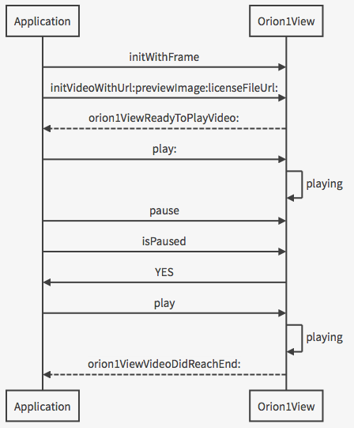

OrionSDK_iOS
==================

Introduction
-------

The Orion SDK is a developer library to easily build and implement mobile applications that utilize immersive **360° video** and **360° image** content.

360° video/image is a special type of content that covers the complete surroundings of the camera. With the Orion SDK, 360° content can be included to mobile apps easily.

>**Tip:** This document provides information about the SDK basics and helps you to get started quickly by providing step-by-step instructions. 

What's new
-------

Build 1.0.0, Jun 23, 2015:
* Initial Commit

Overview
-------

The Orion SDK provides a new iOS library that can be included to 3rd party iOS apps and that greatly simplifies building 360° video/image support to an app.

Showing a single 360° video/image from the remote url or from local file system requires only a few lines of code. This is achieved by providing a 360° video/image player component so that the player can be simply dropped in to a UI layout and initialized with handle to 360° video/image (**Orion1View**).

To summarize, the Orion SDK contains one main component and purpose **Orion1View** to view and play 360 degree content. 

Requirements
----------------

The Orion SDK for iOS requires only the standard development environment for iOS apps. 

Supported Devices
----------------------

The Orion SDK for iOS supports all iOS devices starting iOS version 7.0.

License
-------
By default the SDK works as a **trial version**. To create your own applications, you must acquire a **license** file per each published application. In order to enable the Orion SDK 360 video features the right license file (e.g. license.key.lic) needs to be included in the project. It needs to match the platform (at least "iOS"), application version (version=Orion1) and the bundle ID of the application (e.g. fi.finwe.example-app).
An example header of a license file:

```
packagename=fi.finwe.example-app
enableFeatureExplicit=viewport_split
logo=none
platform=ios
version=Orion1
```

>**Note:** The sample application contains a license file so it can be tested on a real hardware and used for learning and experimenting. However, modified sample app cannot be published to app stores.

#### 3rd Party Licenses & Acknowledgments

For legal reasons, you must include the following acknowledgment somewhere in your application's user interface (must be visible to users). Typically it is placed under "Info" or "About" section with a title "3rd Party Licenses & Acknowledgments".

Installation
-------

The easiest way to take the Orion SDK into use is to utilize the CocoaPods framework. CocoaPods takes care of all required frameworks and third party dependencies. 
First the Cocoapods framework needs to be installed, please check instructions: http://guides.cocoapods.org/using/getting-started.html#installation
To use Orion SDK in your project, run *pod install* in XCode project folder (where .xcp, add simply pod definition to your project podfile: *pod 'OrionSDK'* and finally update the dependencies in project by running *pod update*.

```
source 'https://github.com/FinweLtd/PodSpecs_Prd.git'
source 'https://github.com/CocoaPods/Specs.git'

platform :ios, "7.0"
workspace 'Hello Orion'

target "Hello Orion" do
# Third party libs
pod 'OrionSDK'
end
```

Getting Started
------------------

##License File

To show 360° content you need a **license** file that must be copied to your app project's resources without any modifications. Failure to do so will result to black video player screen.

###Orion1View

**Orion1View** is a simple UIView for viewing 360 degree content. To use Orion1View, you need to import *Orion1View.h* header. **Orion1View** is initialized as follows:

```
Orion1View orion1View = [[Orion1View alloc] initWithFrame:CGRectMake(0, 0, self.view.bounds.size.width, self.view.bounds.size.height)];
orion1View.delegate = self;
```

Note that the license file need to be given.

```
NSString* path = [[NSBundle mainBundle] pathForResource:@"license.key.lic" ofType:nil];
NSURL *licenseURL = [NSURL fileURLWithPath:path];
```

Play 360° video from given NSURL(local or remote) with previewimage(optional)
```
[orion1View initVideoWithUrl:videoUrl previewImageUrl:previewImageUrl licenseFileUrl:licenseURL];
```
**Orion1View** delegate method **orion1ViewReadyToPlayVideo:** is called when the requested video is ready to be played. Note that video starts playing only after **play:** method has been called (e.g. **[orion1View play:0.0]** starts playing the requested video from the beginning). **Orion1View** also provides methods **pause**, **play**,  **seekTo:** and **isPaused**.




Show 360° image from given NSURL(local or remote)
```
[orion1View initImageWithUrl:imageUrl licenseFileUrl:licenseURL];
```
Show 360° image (UIImage)
```
[orion1View initImageWithUIImage:[UIImage imageNamed:@"my360image"]  licenseFileUrl:licenseURL];
```

Note that **Orion1View** inherits **UIView** and therefore inherits also properties and methods provided by UIView (e.g. setting the frame).


